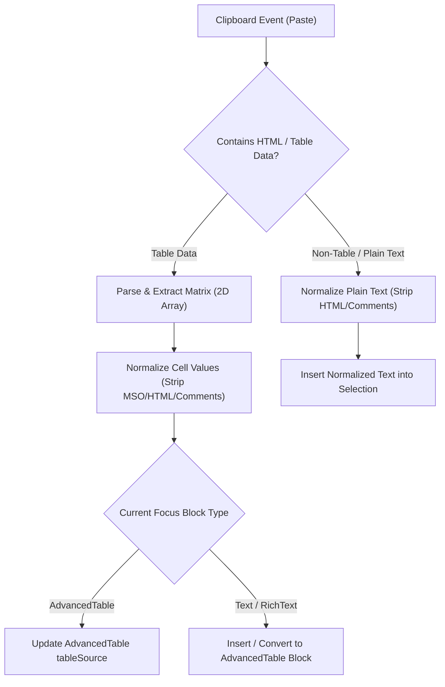

# Design Specification: Excel Table & Data Normalization for InlineText

## Overview
This feature adds support for pasting Excel table data and external content into the `InlineText` component in `easy-email-extensions`. When users paste data from Microsoft Excel or arbitrary HTML sources, `InlineText` will normalize the data ("paste as value") by stripping MSO styles, HTML comments, and inline tags, and fill/insert the normalized content into an `AdvancedTable` block or text selection depending on context.

---

## Intent & Requirements

1. **Strict Data Normalization ("Paste as Value"):**
   - Strip all Microsoft Office (`mso-*`) inline styles, CSS block declarations, class names, tags (``, `<b>`, `<style>`, etc.), and HTML comments (`<!-- ... -->`).
   - Extract raw text values (`textContent.trim()`) for each table cell or text selection.
2. **Context-Aware Table Insertion:**
   - **Inside `AdvancedTable`:** When pasting table data inside an existing `AdvancedTable` block, update the target matrix (`tableSource`) with the normalized plain-text cell values.
   - **Inside `Text` / `RichText` block:** When pasting table data into a standard text block, insert or convert the block into an `AdvancedTable` block pre-filled with the normalized data matrix.
   - **Non-Table Data:** If pasted data is non-tabular, insert standard normalized plain text into the current DOM selection without breaking existing text flow.

---

## Subsystem Architecture & Components

### Component Details

1. **`InlineText` (`packages/easy-email-extensions/src/components/Form/InlineTextField/index.tsx`)**
   - Hooks into the Shadow DOM `paste` event.
   - Intercepts clipboard HTML (`e.clipboardData.getData('text/html')`) and plain text (`e.clipboardData.getData('text/plain')`).
   - Integrates with `useBlock` and `useFocusIdx` from `@thanhpv102/easy-email-editor` to determine current block type and mutate template state when creating/updating `AdvancedTable`.

2. **Parser Utilities (`excelParser.ts` or inline helper within `InlineTextField`)**
   - `parseExcelTable(htmlData: string): IAdvancedTableData[][] | null`
     - Uses DOMParser to query `<table>`, `<tr>`, `<td>`/`<th>` elements.
     - Iterates through rows and cells, extracting `cell.textContent?.trim() || ''`.
     - Returns a 2D matrix formatted as `IAdvancedTableData[][]` (`[{ content: value }]`).
   - `normalizeTextContent(htmlOrTextData: string): string`
     - Strips HTML comments (`/<!--[\s\S]*?-->/g`) and DOM tags to produce clean value text.

---

## Data Flow & State Management

1. User triggers paste (`Ctrl+V` / `Cmd+V`) inside an inline editable target within Shadow DOM.
2. `onPaste` handler prevents default clipboard insertion.
3. Clipboard content is parsed and normalized to extract values.
4. If a matrix is extracted:
   - Evaluates target block type via editor context.
   - If target is `AdvancedTable`: updates `tableSource` with normalized cell values.
   - If target is `Text`/`RichText`: replaces or appends an `AdvancedTable` block with `tableSource`.
5. If non-tabular:
   - Inserts clean normalized text node at the current cursor selection range in Shadow DOM.
   - Invokes `onChange` callback with updated content.

---

## Error Handling & Edge Cases

- **Empty / Malformed HTML:** Falls back gracefully to `text/plain` extraction.
- **Nested Tables:** Only top-level `<tr>`/`<td>` rows are extracted into the 2D matrix; nested tables are flattened into their cell text values.
- **Selection Lost:** Checks if range selection exists in Shadow DOM before inserting nodes to prevent exceptions.

---

## Testing Strategy

1. **Unit / Integration Tests:**
   - Test `parseExcelTable` with sample Excel HTML (containing MSO classes, comments, `<style>` tags) to verify output is clean `IAdvancedTableData[][]`.
   - Test non-table HTML paste to verify comments and inline tags are stripped.
2. **Manual / Verification:**
   - Copy cells from Microsoft Excel and paste into `RichText` block in the demo editor.
   - Verify `AdvancedTable` block is created with normalized text values.
   - Copy cell block from Excel and paste inside an existing `AdvancedTable`. Verify cell values update without MSO inline styles.
