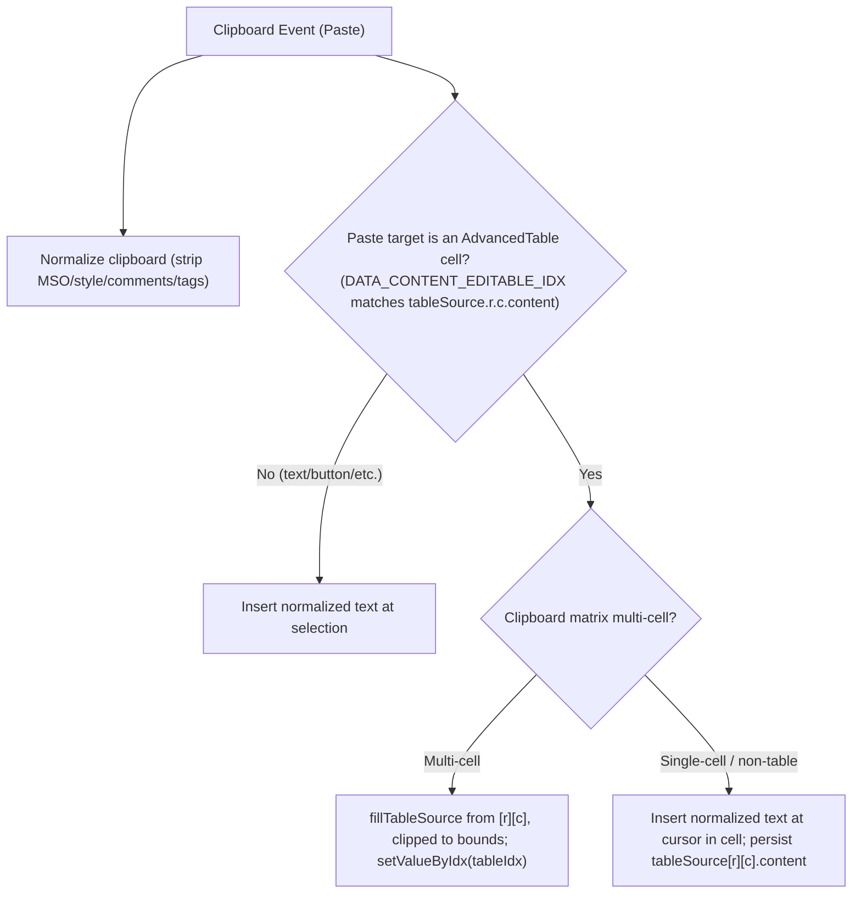

# Design Specification: Excel Table & Data Normalization for InlineText

## Overview
This feature controls what happens when a user pastes Excel/HTML content into an editable region managed by `InlineText` in `easy-email-extensions`. Pasted content is always normalized ("paste as value") — MSO styles, `<style>`/`<script>`, tags, and HTML comments are stripped. Where the normalized data goes depends on the paste target:

- **Target is a text/button block (or any non-table editable):** insert normalized plain text at the cursor. Never create or convert to a table.
- **Target is a cell inside an existing `AdvancedTable`:** fill cells from the focused cell when the clipboard holds a multi-cell table, or insert text at the cursor within the cell for a single-cell/non-table paste.

This supersedes an earlier draft in which pasting table data into a text block converted the block into an `AdvancedTable`. That conversion is removed: pasting into text always yields text.

---

## Intent & Requirements

1. **Strict Data Normalization ("Paste as Value"):**
   - Strip Microsoft Office (`mso-*`) styles, CSS/JS via `<style>`/`<script>` elements, class names, tags (``, `<b>`, etc.), and HTML comments (`<!-- ... -->`).
   - Extract text via DOM `textContent`. Inline tags stay seamless (`a<b>b</b>c` → `abc`); block-level boundaries and ` ` separate adjacent text with a single space (`
A

B
` → `A B`); runs of whitespace collapse to one space.

2. **Target-Aware Placement:**
   - **Non-table target:** normalize the clipboard to plain text and insert it at the current DOM selection (replacing any selected text), preserving existing text flow. A clipboard table pasted here is flattened to text — it does NOT create a table.
   - **AdvancedTable cell target:**
     - The editor already makes each cell `contentEditable` and tags it with `DATA_CONTENT_EDITABLE_IDX = "<tableBlockIdx>.data.value.tableSource.<row>.<col>.content"`. This idx is the anchor for the focused cell; no new cell identifier is added.
     - **Multi-cell clipboard matrix:** write the matrix into the table block's `tableSource` starting at `[row][col]`, going down-and-right, **clipped to the table's existing bounds** (cells beyond the last row/column are dropped; the table never grows). Persist with `setValueByIdx(tableBlockIdx, updatedBlock)`.
     - **Single-cell matrix or non-table clipboard:** insert the normalized value at the cursor within the cell (replacing selected text), like normal text editing, then persist the cell's updated content back to `tableSource[row][col].content`.

---

## Subsystem Architecture & Components

### Component Details

1. **`InlineText` (`packages/easy-email-extensions/src/components/Form/InlineTextField/index.tsx`)**
   - Shadow-DOM `paste` listener. Reads `e.clipboardData` HTML/plain text.
   - Branches on the paste target's `DATA_CONTENT_EDITABLE_IDX` (from `@thanhpv102/easy-email-editor`): a cell idx matches `...tableSource.<r>.<c>.content`; anything else is a non-table target.
   - For the table-cell multi-cell case, uses `useBlock().setValueByIdx` to persist the updated table block.

2. **Parser utilities (`excelParser.ts`)**
   - `parseExcelTable(htmlData: string): IAdvancedTableData[][] | null` — first `<table>`'s top-level rows/cells only (nested tables flatten into cell text); `null` when empty or no `<table>`.
   - `normalizeTextContent(htmlOrTextData: string): string` — comment + `<style>`/`<script>` + tag stripping with block/` ` spacing and whitespace collapsing.

3. **Table placement utilities (`tableCellPaste.ts`)**
   - `parseCellIdx(idx: string): { tableIdx: string; row: number; col: number } | null` — extract the table block idx and cell row/col from a cell's `DATA_CONTENT_EDITABLE_IDX`, or `null` if the idx is not a table-cell idx.
   - `fillTableSource(tableSource, matrix, startRow, startCol): IAdvancedTableData[][]` — return a new matrix with `matrix` overlaid starting at `[startRow][startCol]`, clipped to the original bounds (never grows rows or columns).

---

## Data Flow & State Management

1. User pastes (`Ctrl/Cmd+V`) into a contenteditable region in the Shadow DOM.
2. `onPaste` prevents default and reads clipboard HTML/plain text.
3. Determine target type from the target element's `DATA_CONTENT_EDITABLE_IDX` via `parseCellIdx`.
4. **Non-table target:** insert `normalizeTextContent(...)` at the selection; fire `onChange`.
5. **Table-cell target, multi-cell clipboard:** `fillTableSource(table.tableSource, matrix, row, col)`; `setValueByIdx(tableIdx, updatedBlock)`.
6. **Table-cell target, single-cell/non-table clipboard:** insert normalized text at the cursor in the cell; persist that cell's new `content` into `tableSource[row][col]`.

---

## Error Handling & Edge Cases

- **Empty/malformed HTML:** fall back to `text/plain`.
- **Nested tables:** only the top-level table's rows/cells form the matrix; nested tables flatten into their cell's text.
- **Selection lost:** if no range exists in the Shadow DOM, skip DOM insertion (no exception).
- **Out-of-bounds fill:** cells of the clipboard matrix that fall past the table's last row/column are dropped; the table is never grown.
- **Non-table target + clipboard table:** flattened to text, no table created.

---

## Testing Strategy

1. **Unit tests (Jest + jsdom):**
   - `parseExcelTable`: MSO/`<style>` stripping, comment/whitespace cells → `''`, ragged rows, `th` cells, nested-table flatten, block-content cells, no-table → `null`.
   - `normalizeTextContent`: comment/tag/`<style>`/`<script>` stripping, inline-seamless vs block/` ` spacing, trim/collapse.
   - `parseCellIdx`: valid cell idx → `{tableIdx,row,col}`; a text-block idx → `null`.
   - `fillTableSource`: overlay at offset, clip past bounds, single-cell overlay, no growth.
2. **Manual verification:**
   - Paste a single Excel cell into a text block → text inserted at cursor, block stays a text block.
   - Paste a multi-cell Excel range into an `AdvancedTable` cell → cells fill from that cell, clipped to bounds, no MSO styles.
   - Paste a single cell into an `AdvancedTable` cell → value inserted at cursor within the cell.
